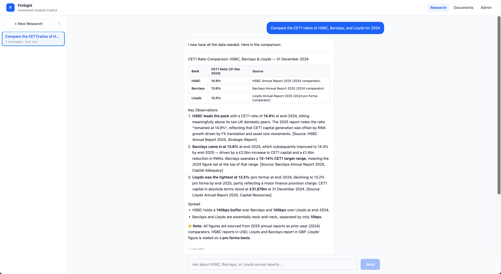
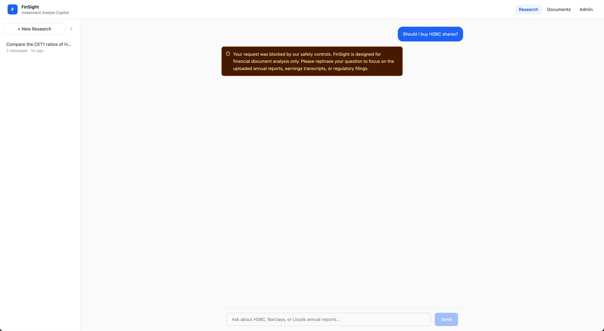
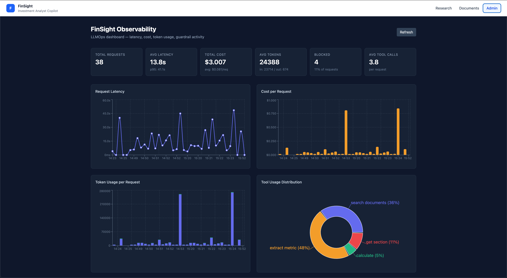
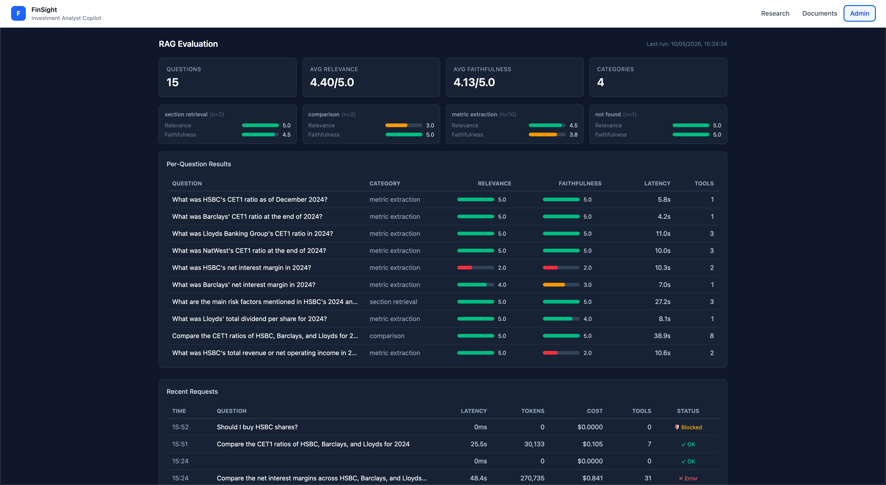
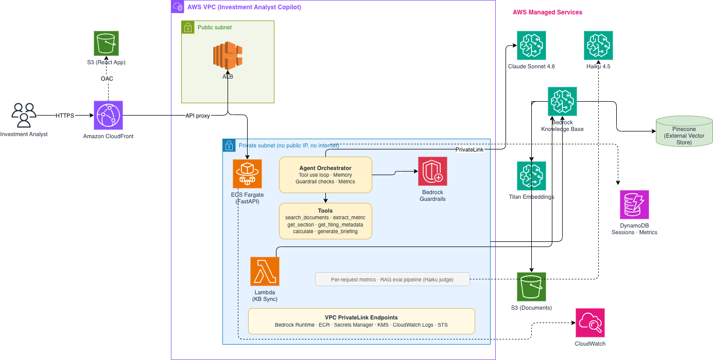

# FinSight — Investment Analyst Copilot

An AI copilot for investment analysts that ingests company annual reports and answers research questions across multiple documents with cited sources. Ask "compare HSBC and Barclays net interest margins" and get a structured answer with page-level citations — work that currently takes hours of manual reading.

Built as a production-grade agentic system on AWS with a React frontend, demonstrating GenAI, RAG, agentic tool use, guardrails, and LLMOps in a regulated financial services context.

## What It Does

An analyst uploads annual reports (HSBC, Barclays, Lloyds, NatWest) and asks research questions in natural language. The agent decides which tools to call, extracts metrics from the right documents, compares across companies, and returns grounded answers with source citations.

**Example queries:**

| Query | What Happens |
|---|---|
| "What was HSBC's CET1 ratio in 2024?" | Calls `extract_metric`, returns 14.9% with page citation |
| "Compare CET1 ratios across all three banks" | Calls `extract_metric` per bank, builds comparison table |
| "Summarise risk factors from the Barclays annual report" | Calls `get_section`, returns structured summary |
| "Should I buy HSBC shares?" | Blocked by Bedrock Guardrails — investment advice denied |
| "What was Goldman Sachs' CET1 ratio?" | Correctly says "not in the available documents" |
| "Draft a briefing comparing HSBC and Barclays" | Orchestrates multiple tools, generates structured document |

## Screenshots

**Research chat** — multi-bank CET1 comparison with structured table, key observations, and source citations from all three annual reports:



**Guardrail block** — investment advice request blocked by Bedrock Guardrails with a clear redirect message:



**Observability dashboard** — live per-request metrics with latency, cost, token usage, and tool distribution:



**RAG evaluation** — automated quality scoring with per-category breakdown and per-question results:



## Architecture



**Key architectural decisions:**
- All compute runs in private subnets with no public IPs — AWS API calls go through VPC PrivateLink endpoints
- Bedrock model invocations never leave the AWS network
- Every IAM role is single-purpose with no wildcard permissions
- Infrastructure deploys and destroys cleanly with `cdk deploy` / `cdk destroy`

## Tech Stack

| Layer | Technology |
|---|---|
| Frontend | React, TypeScript, Tailwind, Vite, TanStack Router, Recharts |
| API | FastAPI (Python), SSE streaming |
| Compute | ECS Fargate (private subnet), Lambda |
| CDN / Routing | CloudFront with OAC, API proxy behaviors |
| AI / LLM | Bedrock Claude Sonnet 4.6 (inference), Haiku 4.5 (eval judge) |
| Embeddings | Bedrock Titan Embeddings v2 |
| RAG | Bedrock Knowledge Base + Pinecone (vector store) |
| Guardrails | Bedrock Guardrails (topic denial, content filters, word filters, prompt attack detection) |
| Document Store | S3 (SSE encryption, Block Public Access, versioning) |
| Metadata | DynamoDB (on-demand, point-in-time recovery) |
| Network | VPC, private subnets, PrivateLink (Bedrock, ECR, Secrets Manager, KMS, CloudWatch Logs, CloudWatch Monitoring, STS, Lambda) |
| IaC | AWS CDK (TypeScript) |
| Monitoring | CloudWatch custom metrics + alarms, SNS alerts, per-request dashboard, RAG eval pipeline |

## Project Structure

```
finsight/
├── backend/
│   ├── app/
│   │   ├── agent.py          # Agentic tool use loop with streaming
│   │   ├── bedrock.py         # Bedrock client, RAG config, system prompt
│   │   ├── documents.py       # Document CRUD, presigned uploads, KB sync
│   │   ├── eval_store.py      # Eval results storage in DynamoDB
│   │   ├── guardrails.py      # Regex prompt injection detection
│   │   ├── guardrail_test.py  # ApplyGuardrail API wrapper
│   │   ├── main.py            # FastAPI endpoints
│   │   ├── metrics.py         # Per-request metrics logging & aggregation
│   │   ├── sessions.py        # Conversation history persistence
│   │   └── tools.py           # Tool definitions & execution handlers
│   ├── eval/
│   │   ├── eval_dataset.json  # 15 curated Q&A test pairs
│   │   ├── run_eval.py        # RAG evaluation pipeline (LLM-as-a-judge)
│   │   └── results/           # Timestamped eval results
│   └── tests/
│       └── test_guardrails.py # 56 adversarial tests (3 layers)
├── frontend/
│   └── src/
│       └── pages/
│           ├── ChatPage.tsx       # Research chat with streaming & citations
│           ├── DocumentsPage.tsx  # Document library & upload
│           └── AdminPage.tsx      # Observability dashboard & eval results
├── infra/
│   ├── bin/infra.ts
│   └── lib/
│       ├── networking-stack.ts    # VPC, subnets, PrivateLink endpoints
│       ├── data-stack.ts          # S3, DynamoDB tables
│       ├── knowledge-base-stack.ts # Bedrock KB + Pinecone data source
│       ├── guardrail-stack.ts     # Bedrock Guardrail policies
│       ├── compute-stack.ts       # ECS Fargate, ALB, Lambda, IAM
│       ├── frontend-stack.ts      # S3, CloudFront, OAC
│       ├── monitoring-stack.ts    # CloudWatch alarms, SNS alerts
│       └── config.ts             # Account, region, model IDs
├── scripts/
│   ├── deploy.sh
│   └── destroy.sh
└── package.json                   # Root scripts: deploy, destroy, test, lint, eval
```

## Guardrails & Security

Three-layer defence for a regulated financial environment:

**Layer 1 — Regex (pre-Bedrock):** Instant, free, catches known injection patterns ("ignore your instructions", "system:", jailbreak keywords). Runs as a pre-deploy gate.

**Layer 2 — Bedrock Guardrails (ApplyGuardrail API):** ML-based classification catches semantic violations that regex can't. Topic denial (investment advice, personal finance), word filters ("buy rating", "price target"), content filters (hate, violence, misconduct), prompt attack detection.

**Layer 3 — System prompt:** Claude refuses gracefully with helpful redirects for edge cases that pass both layers.

Proven by a **56-test adversarial suite** across all three layers:
- 33 regex tests (15 injection blocks, 15 legitimate passes, 3 edge cases)
- 18 ApplyGuardrail API tests (9 input blocks, 5 input passes, 4 output blocks)
- 5 end-to-end agent stream tests

```bash
# Run regex tests (no AWS needed)
npm test

# Run regex + guardrail API tests
npm run test:guardrail

# Run all layers (full stack deployed)
npm run test:e2e
```

## LLMOps & Observability

**Per-request metrics** logged to DynamoDB: latency, token usage (input/output), estimated cost, tool calls, guardrail results. Aggregated and displayed in a live admin dashboard with:
- Stat cards: total requests, avg latency (with p95), total cost, blocked %, avg tool calls
- Latency line chart, cost per request bar chart
- Token usage (stacked input/output), tool usage distribution pie chart
- Recent requests table with status indicators

**Drift detection & cost alarms** via CloudWatch:
- Custom metrics published per request (latency, cost, tokens, errors, guardrail blocks)
- High latency alarm: p95 > 30s (agent stuck in loop or Bedrock throttling)
- Cost spike alarm: > $1 in 5 minutes (runaway agentic chains)
- Error rate alarm: 3+ errors in 5 minutes (Bedrock failures)
- SNS email notifications, alert email injected at deploy time via CDK context

**RAG evaluation pipeline** using LLM-as-a-judge (Haiku):
- 15 curated Q&A pairs across 4 categories: metric extraction, section retrieval, cross-document comparison, not-found detection
- Each answer scored for relevance (1-5) and faithfulness (1-5) with reasoning
- Results stored in DynamoDB and displayed in the admin dashboard
- Category breakdown with colour-coded score bars

## Setup

### Prerequisites
- AWS account with Bedrock model access enabled (Claude Sonnet 4.6, Haiku 4.5, Titan Embeddings v2)
- Pinecone free tier account with API key
- Node.js 18+, Python 3.12+, Docker, AWS CDK CLI

### Configuration
1. Clone the repo
2. Copy `infra/lib/config.ts` and update your AWS account ID and region
3. Store your Pinecone API key in AWS Secrets Manager
4. Bootstrap CDK: `cd infra && cdk bootstrap`

### Deploy
```bash
npm run deploy    # Deploys all CDK stacks (runs tests first)
```

### Tear Down
```bash
npm run destroy   # Destroys all billable resources
```

> **Cost note:** PrivateLink + Fargate ≈ £0.15/hr. Always tear down after dev sessions. S3, DynamoDB, Pinecone free tier, and CloudFront cost pennies idle.

### Ingest Documents
Upload annual reports (PDF) through the Document Library page, or place them in the S3 documents bucket and trigger a Knowledge Base sync.

### Run Tests
```bash
npm test              # Regex guardrail tests (offline)
npm run test:guardrail # + ApplyGuardrail API tests
npm run test:e2e       # + End-to-end agent tests (needs full stack)
```

### Run Evaluation
```bash
npm run eval          # 15-question RAG eval with LLM judge (needs full stack)
```

## Estimated Cost (Portfolio Scale)

Solo developer, ~3-4 hours active per day, tear down between sessions:

| Service | Est. Monthly Cost |
|---|---|
| Bedrock (Claude Sonnet 4.6) | £3-8 |
| Bedrock (Titan Embeddings) | ~£1 |
| Pinecone (free tier) | £0 |
| ECS Fargate (0.25 vCPU, ~3-4hrs/day) | £5-8 |
| VPC PrivateLink endpoints (~3-4hrs/day) | £5-8 |
| S3 + CloudFront + DynamoDB | £2-3 |
| **Total** | **£15-30/month** |
